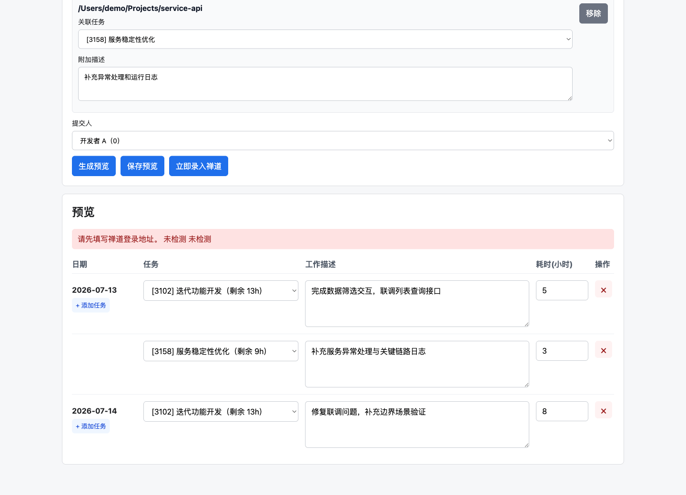

# Zentao Log Agent

本地禅道工作日志 Agent。它从 Git、HG、SVN 提交和附加描述生成按日期拆分的中文工作日志，提供可编辑预览，并通过禅道 HTTP 接口完成录入。

[官方网站](https://wanghuanlab.github.io/DS-OA-Agent/) · [下载最新版本](https://github.com/wanghuanlab/DS-OA-Agent/releases/latest) · [查看发布记录](https://github.com/wanghuanlab/DS-OA-Agent/releases)



## 亮点

- 自动识别 Git、Mercurial 和 SVN，普通目录会被忽略
- 按提交日期和提交人汇总代码工作，可同时结合每个代码库的附加描述
- 每个代码库可保留上次选择的任务关联和提交人
- 同一日期支持多条任务、工作描述和耗时
- 提交时根据任务初始预计、累计消耗和本次耗时计算预计剩余
- 禅道、LLM、代码库与任务设置自动保存到当前用户的本地 JSON
- 默认每周五 16:00 生成预览，保留 60 分钟确认时间，17:00 自动录入
- 提供 macOS 和 Windows 桌面客户端，关闭窗口后可驻留托盘运行

## 下载与安装

前往 [GitHub Releases](https://github.com/wanghuanlab/DS-OA-Agent/releases/latest) 下载对应平台的安装包：

| 平台 | 安装包 |
|------|--------|
| macOS Apple Silicon | `arm64` DMG 或 ZIP |
| macOS Intel | `x64` DMG 或 ZIP |
| Windows 64 位 | 安装版或便携版 EXE |

本项目暂未配置 Apple 和 Windows 代码签名证书，操作系统首次运行时可能显示来源或安全提醒。

代码库检查依赖电脑已安装的命令行工具：Git 仓库需要 `git`，HG 仓库需要 `hg`，SVN 仓库需要 `svn`。

## 使用方式

1. 启动客户端，填写禅道登录地址、账号和任务页地址。
2. 填写 LLM Base URL、API Key 和模型。默认 Base URL 为 `https://api.deepseek.com`，默认模型为 `deepseek-v4-flash`。
3. 选择填报日期和本机代码库目录，检查提交记录并选择提交人。
4. 为每个代码库关联任务，可按需填写附加描述。
5. 生成预览，调整每条日志的任务、工作描述与耗时。
6. 点击“立即录入禅道”，或保留客户端在托盘中执行周五定时流程。

## 本地开发

```bash
npm install
npm test
npm run desktop
```

启动 Web 模式：

```bash
npm run install:browsers
npm start
```

启动后访问 `http://127.0.0.1:5173`。

## 打包

```bash
npm run build:mac:arm64
npm run build:mac:x64
npm run build:win
```

安装包输出到 `dist/`。macOS 安装包需要在 macOS 上构建，Windows 安装包建议在 Windows 上构建。推送 `v*` 标签后，GitHub Actions 会为三个目标平台构建安装包并创建 GitHub Release。

## 配置与隐私

桌面客户端把配置和预览保存在系统用户数据目录：

- macOS：`~/Library/Application Support/Zentao Log Agent/`
- Windows：`%APPDATA%\Zentao Log Agent\`

Web 模式使用本地 `config/config.json`。该文件已被 Git 忽略，不会进入安装包或远程仓库。仓库只提供不含凭据的 [`config/config.example.json`](config/config.example.json)。

密码和 API Key 会以本地 JSON 形式保存，请保护当前操作系统账户，并避免手动分享用户数据目录。

## 项目结构

```text
desktop/      Electron 主进程与桌面集成
src/          配置、生成、调度、版本库与禅道服务
public/       客户端工作台界面
website/      官方网站静态资源
config/       脱敏配置示例
test/         单元测试
```

## License

Private © wanghuanlab
